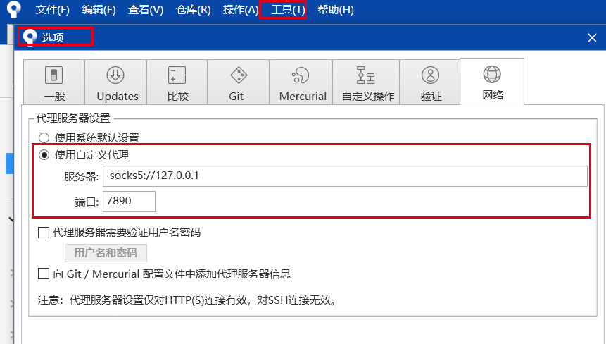
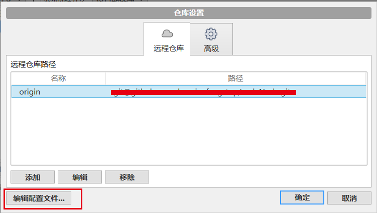
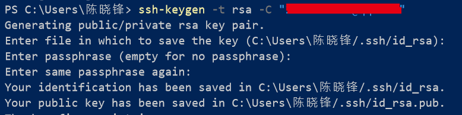
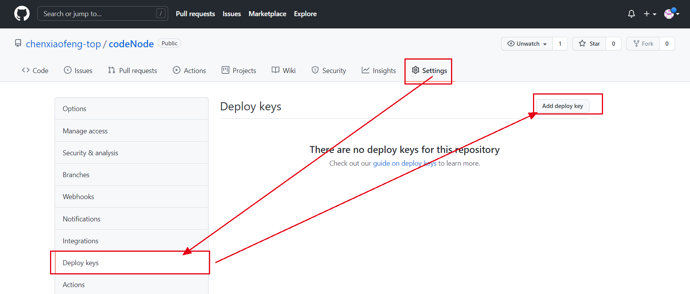
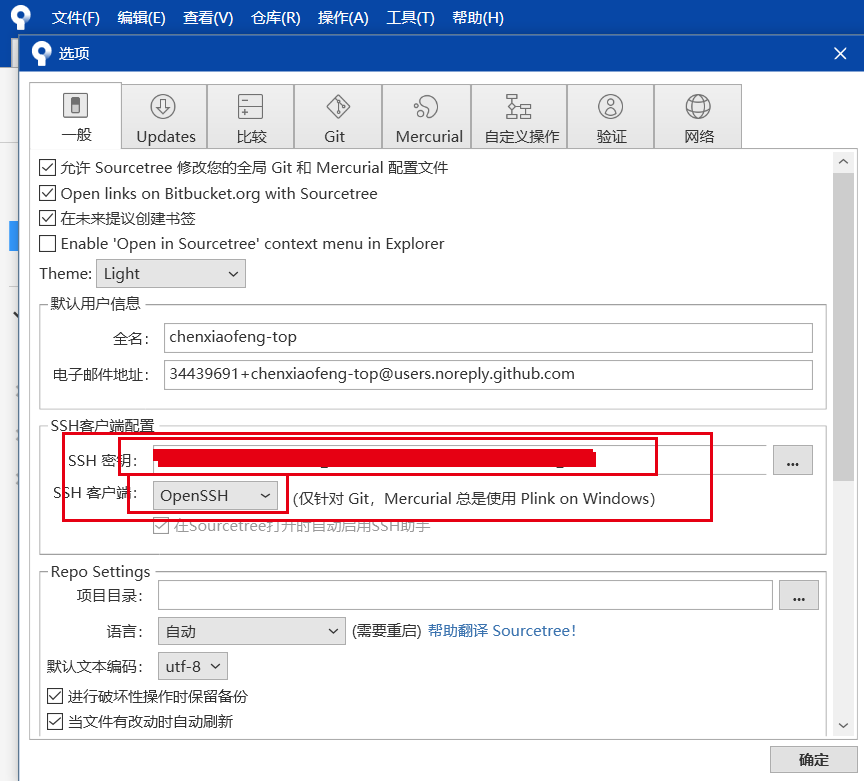

## ，提交异常及方案

### 一，超时设置代理（clash），二选一

方法一：全局




方法二，对仓库进行设置



增加以下代码

```properties
[core]
	gitproxy = socks5://127.0.0.1:7890
[http]
	postBuffer = 524288000
	postBuffer = 524288000
	proxy = socks5://127.0.0.1:7890
[https]
	postBuffer = 524288000
	postBuffer = 524288000
	proxy = socks5://127.0.0.1:7890
```


### 二，输入账号密码正确，但认证失败

1. 不使用https,要用ssh

2. 在电脑中创建sshkey，把公钥放到github上

   ```shell
    ssh-keygen -t rsa -C "邮件地址"
   ```

   在输出信息中找到生成的位置 Enter file in which to save the key

   

3. 把公钥放到github上

   

4. 把私钥放到sourceTree上



完成，可以提交