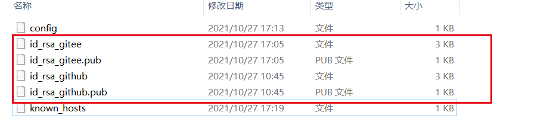
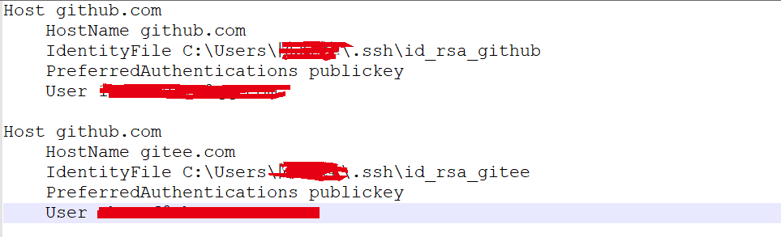
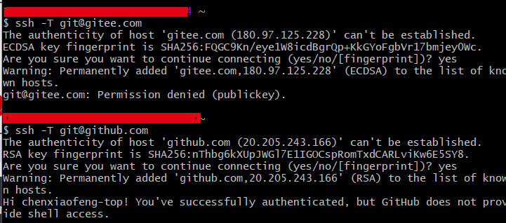

# git不同仓库的账号管理20211027

## 一，问题：

1，公司用https://gitee.com/，而个人用https://github.com/，需要分开管理，不然至少会有一个认证失败。


## 二，说明

1. 只能用ssh，无法用https。

## 三，步骤

1. 生成两对私钥公钥，每个仓库分配一个公钥
2. 在.ssh目录下创建config文件，配置每个仓库与私钥的关系
3. 在Git Bash客户端执行测试命令,会自动生成known_hosts

## 四，详细

### 	1，生成两对私钥公钥，每个仓库分配一个公钥

```sh
ssh-keygen -t rsa -C "邮件地址"
```



完成后把公钥分配到对应的git服务商

### 2，在.ssh目录下创建config文件，配置每个仓库与私钥的关系

```properties
Host github.com                 
    HostName github.com 域名地址
    IdentityFile id_rsa的地址
    PreferredAuthentications publickey 配置登录时的权限认证 (取值publickey,password publickey,keyboard-interactive等)
    User 用户名
```



### 3，在Git Bash客户端执行测试命令,会自动生成known_hosts

```sh
 ssh -T git@gitee.com
 ssh -T git@github.com
```

