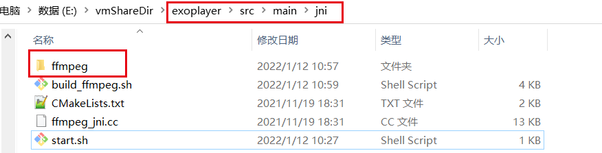
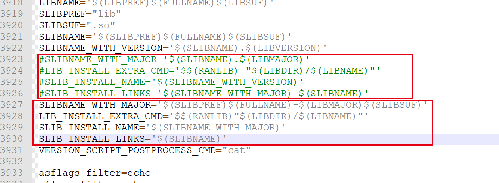
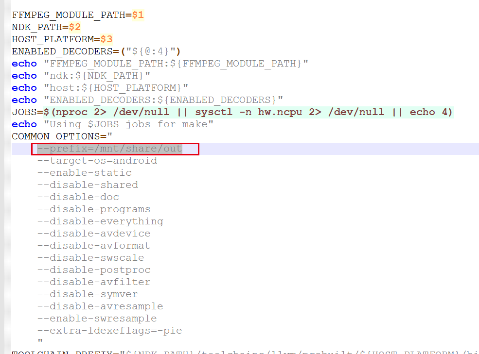

## 环境及文件

1. ffmpeg文件源码：git clone https://git.ffmpeg.org/ffmpeg.git ffmpeg
2. ndk:https://developer.android.com/ndk/downloads
3. exoPlayer的扩展文件:https://github.com/google/ExoPlayer/tree/release-v2/extensions/ffmpeg

目录配置：把ffmpeg文件源码放到exoPlayer的扩展文件的\src\main\jni\下



编译配置：

需要修复的文件：jni目录下的

1. build_ffmpeg.sh
2. ffmpeg/configure

### build_ffmpeg.sh修改:

```shell
FFMPEG_MODULE_PATH=$1 #指定jni的父文件夹
NDK_PATH=$2           #ndk的文件夹路径
HOST_PLATFORM=$3      #编译环境，是ndk中的一个文件夹名称
#创建一个start.sh来传入相关参数
#!/bin/bash
./build_ffmpeg.sh \
"/mnt/share/exoplayer/src/main" \
"/mnt/share/android-ndk-r23b" \
"linux-x86_64" \

```

### ffmpeg/configure修改



```
#SLIBNAME_WITH_MAJOR='$(SLIBNAME).$(LIBMAJOR)'
#LIB_INSTALL_EXTRA_CMD='$$(RANLIB) "$(LIBDIR)/$(LIBNAME)"'
#SLIB_INSTALL_NAME='$(SLIBNAME_WITH_VERSION)'
#SLIB_INSTALL_LINKS='$(SLIBNAME_WITH_MAJOR) $(SLIBNAME)'
SLIBNAME_WITH_MAJOR='$(SLIBPREF)$(FULLNAME)-$(LIBMAJOR)$(SLIBSUF)'  
LIB_INSTALL_EXTRA_CMD='$$(RANLIB)"$(LIBDIR)/$(LIBNAME)"'  
SLIB_INSTALL_NAME='$(SLIBNAME_WITH_MAJOR)'  
SLIB_INSTALL_LINKS='$(SLIBNAME)'
```

原因：下载FFmpeg源代码之后，首先需要对源代码中的configure文件进行修改。

由于编译出来的动态库文件名的版本号在.so之后（例如“libavcodec.so.5.100.1”），而android平台不能识别这样文件名，所以需要修改这种文件名。

build_ffmpeg.sh修改（增加需要指定的功能）:

参考https://juejin.cn/post/6844904052807958536

```shell
#增加输出路径
--prefix=/mnt/share/out
```




如果在window修复文件的话，那可能会多一些字符，通过以下命令去掉

```shell
sed -i 's/\r$//'
```

- 编译前需要到ffmepg文件执行 

- ```
  在执行sh脚本前先执行./configure 
  ```

- 输入默认位置

- ```
  系统默认给编译到了/usr/local路径下的includ和lib文件夹里了。整的时一头雾水。
  ```


## 安装:yasm

```
# wget http://www.tortall.net/projects/yasm/releases/yasm-1.3.0.tar.gz
# tar zxvf yasm-1.3.0.tar.gz
# cd yasm-1.3.0
# ./configure
# make && make install
```

