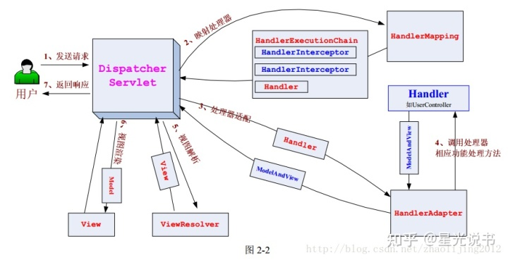

## spring 

1. 对象的管理，对象的实例化由spring来控制
   - 控制反转 IOC
2. 对象的方法管理，方法的拦截
   - 切面编程 AOP 
3. spring可以理解为对象管理的容器

## spring mvc 

- 是什么？
  - 以spring为核心的web应用
  - M-Model 模型（完成业务逻辑：有javaBean构成，service+dao+entity）
  - V-View 视图（做界面的展示 jsp，html……），其中jsp已经过时，前段用vue等框架
  - C-Controller 控制器（接收请求—>调用模型—>根据结果派发页面）
- 组件
  - DispatcherServlet：作为前端控制器，整个流程控制的中心，控制其它组件执行，统一调度，降低组件之间的耦合性，提高每个组件的扩展性。
  - HandlerMapping：通过扩展处理器映射器实现不同的映射方式，例如：配置文件方式，实现接口方式，注解方式等。
  - HandlerAdapter：通过扩展处理器适配器，支持更多类型的处理器。
    - Handler:Controller的实现，**开发者实现**
  - ViewResolver：通过扩展视图解析器，支持更多类型的视图解析，例如：jsp、freemarker、pdf、excel等的解析。
    - View（不属于组件，是给前段的数据）：可以是解析后的jsp,json串,数据流等等，**开发者实现**

 

- 功能

  - FileUpload
  - Logging
  - Filters
  - Annotated 注解
  - Method Arguments
  - 配置
    - @Configuration @ComponentScan("org.example.web")
  - AOP 面向切面编程

- 注解
- 注解
  
  - @Controller： 用于标识是处理器类；@RequestMapping： 请求到处理器功能方法的映射规则；
  - @RequestParam： 请求参数到处理器功能处理方法的方法参数上的绑定；
  - @ModelAttribute： 请求参数到命令对象的绑定；
  - @SessionAttributes： 用于声明 session 级别存储的属性，放置在处理器类上，通常列出模型属性（如
  - @ModelAttribute：对应的名称，则这些属性会透明的保存到 session 中；
  - @InitBinder： 自定义数据绑定注册支持，用于将请求参数转换到命令对象属性的对应类型；
  - @CookieValue： cookie 数据到处理器功能处理方法的方法参数上的绑定；
  - @RequestHeader： 请求头（header）数据到处理器功能处理方法的方法参数上的绑定；
  - @RequestBody： 请求的 body 体的绑定（通过 HttpMessageConverter 进行类型转换）；
  - @ResponseBody： 处理器功能处理方法的返回值作为响应体（通过 HttpMessageConverter 进行类型转换）；
  - @ResponseStatus： 定义处理器功能处理方法/异常处理器返回的状态码和原因；
  - @ExceptionHandler： 注解式声明异常处理器；
  - @PathVariable： 请求 URI 中的模板变量部分到处理器功能处理方法的方法参数上的绑定，从而支持 RESTful 架构风格的 URI；
  - @Valid： JSR-303 验证框架的无缝支持
  - @DateTimeFormat： 来进行数字和日期的格式化
