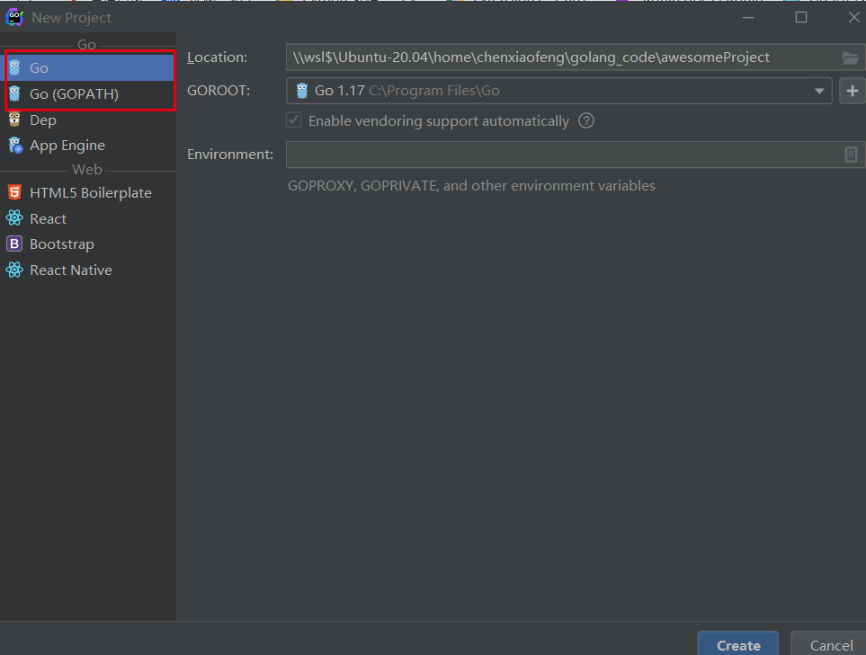
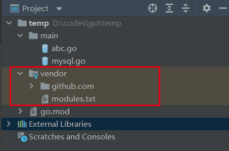
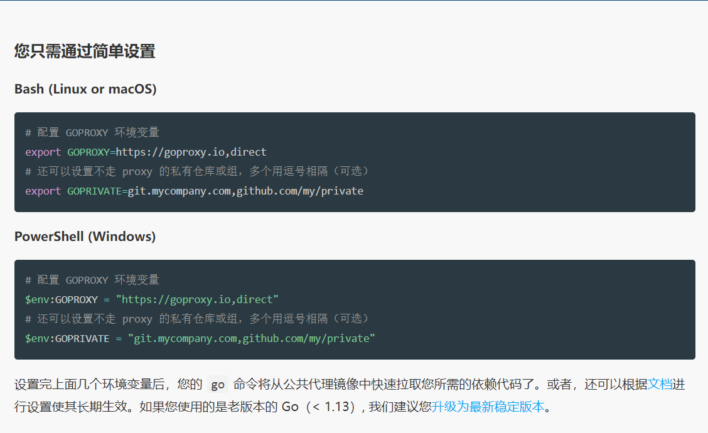

### Golang IDE 版本 


### 初始化

1. 现在有go(go mod) 就不需要再选择go(GOPATH):
2. go mod:**可以自定义开发目录**
3. GOPATH：只能在规定的目录下，再创建一个文件夹作为开发目录


### 引入依赖,

在当前目录下执行 go mod vendor
其它相关命令：

```go
go mod download    download modules to local cache (下载依赖的module到本地cache))
go mod edit        edit go.mod from tools or scripts (编辑go.mod文件)
go mod graph       print module requirement graph (打印模块依赖图))
go mod init        initialize new module in current directory (再当前文件夹下初始化一个新的module, 创建go.mod文件))
go mod tidy        add missing and remove unused modules (增加丢失的module，去掉未用的module)
go mod vendor      make vendored copy of dependencies (将依赖复制到vendor下)
go mod verify      verify dependencies have expected content (校验依赖)
go mod why         explain why packages or modules are needed (解释为什么需要依赖)
```

结果：



### 代理设置：

代理网站：[goproxy.io](https://goproxy.io/zh/)

```sh
linux
# 配置 GOPROXY 环境变量
export GOPROXY=https://goproxy.io,direct
# 还可以设置不走 proxy 的私有仓库或组，多个用逗号相隔（可选）
export GOPRIVATE=git.mycompany.com,github.com/my/private

windows
go env -w GO111MODULE=on 
go env -w GOPROXY=https://goproxy.cn,direct

其它到官网查看
```



