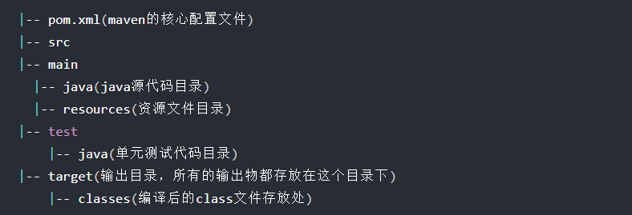
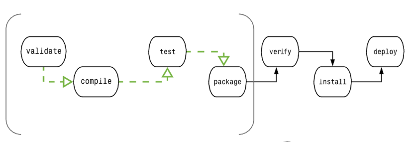

## pom.xm项目配置

通过pom.xm配置项目信息

## setting.xml配置

配置全局的maven信息，例如本地仓库在哪里

## 标准工程结构



## 默认的pom.xml配置信息

所有的pom.xml都存在默认的父pom.xml，指定了默认配置，也是约定优于配置的来源，例如工程构构，源码目录，输出目录

```shell
#查看默认配置的数据
mvn help:effective-pom
```

## 构建流程

- 清理clean：将以前编译得到的旧文件class字节码文件删除
- 编译compile：将java源程序编译成class字节码文件
- 测试test：自动测试，自动调用junit程序
- 报告report：测试程序执行的结果
- 打包package：动态Web工程打War包，java工程打jar包
- 安装install：Maven特定的概念-----将打包得到的文件复制到“仓库”中的指定位置
- 部署deploy：将动态Web工程生成的war包复制到Servlet容器下，使其可以运行

## 常用maven命令

- mvn clean：清理
- mvn compile：编译主程序
- mvn test-compile：编译测试程序
- mvn test：执行测试
- mvn package：打包
- mvn install：安装

## 生命周期



| 阶段          | 处理     | 描述                                                     |
| :------------ | :------- | :------------------------------------------------------- |
| 验证 validate | 验证项目 | 验证项目是否正确且所有必须信息是可用的                   |
| 编译 compile  | 执行编译 | 源代码编译在此阶段完成                                   |
| 测试 Test     | 测试     | 使用适当的单元测试框架（例如JUnit）运行测试。            |
| 包装 package  | 打包     | 创建JAR/WAR包如在 pom.xml 中定义提及的包                 |
| 检查 verify   | 检查     | 对集成测试的结果进行检查，以保证质量达标                 |
| 安装 install  | 安装     | 安装打包的项目到本地仓库，以供其他项目使用               |
| 部署 deploy   | 部署     | 拷贝最终的工程包到远程仓库中，以共享给其他开发人员和工程 |

Maven 有以下三个标准的生命周期：

- **clean**：项目清理的处理
- **default(或 build)**：项目部署的处理
- **site**：项目站点文档创建的处理
