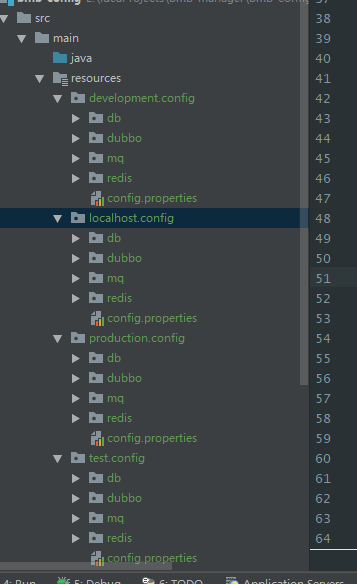

## 项目信息配置

```xml
<project xmlns="http://maven.apache.org/POM/4.0.0" xmlns:xsi="http://www.w3.org/2001/XMLSchema-instance"
         xsi:schemaLocation="http://maven.apache.org/POM/4.0.0 http://maven.apache.org/xsd/maven-4.0.0.xsd"> 

    <modelVersion>4.0.0</modelVersion>
    <groupId>项目所属</groupId>
    <artifactId>项目名</artifactId>
    <version>版本号</version>
    <!--项目产生的构件类型，例如jar、war、ear、pom。插件可以创建他们自己的构件类型，所以前面列的不是全部构件类型 -->
    <!--一般情况:parent是pom, module是jar或着war-->
    <packaging>pom</packaging>

</project>
```

## 指定父POM(继承)

- 父pom可以管理一些共有的依赖
- 父pom可以作为根目录，同时管理编译
- 父pom可以作为其中一个子pom，管理依赖和插件

```xml
<parent>
    <groupId>org.springframework.boot</groupId>
    <artifactId>spring-boot-starter-parent</artifactId>
    <version>2.1.5.RELEASE</version>
    <!-- 父项目的pom.xml文件的相对路径。相对路径允许你选择一个不同的路径。默认值是../pom.xml。Maven首先在构建当前项目的地方寻找父项目的pom，其次在文件系统的这个位置（relativePath位置），然后在本地仓库，最后在远程仓库寻找父项目的pom。 -->
    <relativePath/>
</parent>
```

## 自动构建子模块(聚合特性)

- 都属于同一个项目，不过把项目拆成了很多小模块,分开管理
- 父pom一般在根目录，可以一次性编译全部模块

```xml
<modules>
    <module>../crm-dao</module>
    <module>../crm-service</module>
    <module>../crm-web</module>
    <module>litemall-core</module>
    <module>litemall-db</module>
</modules>
```

## 配置依赖

- scope值

  | scope    | 说明                                          | 示例            |
  | :------- | :-------------------------------------------- | :-------------- |
  | compile  | 编译时需要用到该jar包（默认）                 | commons-logging |
  | test     | 编译Test时需要用到该jar包                     | junit           |
  | runtime  | 编译时不需要，但运行时需要用到                | mysql           |
  | provided | 编译时需要用到，但运行时由JDK或某个服务器提供 | servlet-api     |

- dependencyManagement

  - 在顶层的pom
  - 让所有的子模块使用依赖项的统一版本
  - 让子项目中引用一个依赖而不用显示的列出版本号

```xml
<dependencyManagement>
    <dependencies>
        ...
    </dependencies>
</dependencyManagement>

 <!--正常情况 -->
<dependencies> 
    <dependency>
        <groupId>org.springframework</groupId>
        <artifactId>spring-context</artifactId>
        <version>${org.springframework-version}</version>
        <!-- scope可以不填，默认compile -->
        <scope>compile</scope>
        <!-- 排除依赖 -->
        <exclusions>
            <exclusion>
                <groupId>tomcat</groupId>
                <artifactId>jasper-runtime</artifactId>
            </exclusion>
        </exclusions>
    </dependency>
</dependencies>
```

## 仓库设置

- 本地仓库，统一管理，在setting.xml中设置

  - setting.xml中的<localRepository>/path/to/local/repo</localRepository>

- 远程仓库

  ```xml
  <repositories>
      <repository>
          <id>alimaven</id>
          <url>https://maven.aliyun.com/repository/public</url>
      </repository>
  </repositories>
  <pluginRepositories>
      <pluginRepository>
          <id>alimaven</id>
          <url>https://maven.aliyun.com/repository/public</url>
      </pluginRepository>
  </pluginRepositories>
  ```
  
  repositorie的参数,一般有id和url就够了
  
  | id             | 标识仓库的唯一值，central会覆盖中央仓库                      |
  | -------------- | ------------------------------------------------------------ |
  | name           | 仓库名称                                                     |
  | releases       | true表示开启仓库发布版本下载，false表示禁止                  |
  | snapshots      | false表示禁止快照版本下载，true表示支持                      |
  | url            | 仓库地址，基于http协议                                       |
  | updatePolicy   | 远程仓库的检查频率：never-从不检查，always-每次构建都检查，interval：x-每x分钟检查，daily-每天检查 |
  | checksumPolicy | 检查检验和文件的策略：ignore-不检查，warn-校验错误警告，fail-校验错误构建失败 |

## 配置插件

- 代码

```xml
<build>
    <plugins>
        <plugin>
            <groupId>org.apache.maven.plugins</groupId>
            <artifactId>maven-compiler-plugin</artifactId>
            <version>2.3.2</version>
            <configuration>
                <source>1.7</source>
                <target>1.7</target>
            </configuration>
        </plugin>
    </plugins>
</build>
```

## properties配置

- 定义变量

  ```xml
  <properties>
      <project.build.sourceEncoding>UTF-8</project.build.sourceEncoding>
      <java.version>1.8</java.version>
      <maven.test.skip>true</maven.test.skip>
  </properties>
  ```

- 引用变量

  ${java.version}

## 引入其它模块

- 模块a引用模块b,与引用依赖一样

```xml
<dependency>
    <groupId>org.linlinjava</groupId>
    <artifactId>litemall-wx-api</artifactId>
</dependency>
```

## 配置资源文件

- filtering说明

  ```ini
  jdbc.url=${pom.jdbc.url}
  jdbc.username=${pom.jdbc.username}
  jdbc.passworkd=${pom.jdbc.password}
  #转成
  jdbc.url=jdbc:mysql://127.0.0.1:3306/dev
  jdbc.username=root
  jdbc.passworkd=123456
  ```

```xml
<build>
    <resources>
        <resource>
            <directory>src/main/resources</directory>
            <excludes>
                <exclude>**/*.properties</exclude>
                <exclude>**/*.xml</exclude>
            </excludes>
            <filtering>false</filtering>
        </resource>
        <resource>
            <directory>src/main/java</directory>
            <includes>
                <include>**/*.properties</include>
                <include>**/*.xml</include>
            </includes>
            <!-- Filtering 是 maven 的 resource 插件 提供的功能，作用是用环境变量、pom文件里定义的属性和指定配置文件里的属性替换属性(*.properties)文件里的占位符(${jdbc.url})，具体使用如下：
在src/main/resources目录有个配置文件jdbc.properties -->
            <filtering>true</filtering>
        </resource>
    </resources>
</build>
```

## 配置开发环境与测试环境

- 在pom.xm增加

  ```xml
  <!-- 定义打包环境变量，本地环境，生产环境；测试环境；开发环境 -->
  <profiles>
      <profile>
          <!-- 本地开发环境 -->
          <id>localhost</id>
          <properties>
              <profiles.active>localhost</profiles.active>
          </properties>
          <!-- 默认开发环境 -->
          <activation>
              <activeByDefault>true</activeByDefault>
          </activation>
      </profile>
      <profile>
          <!-- 开发环境 -->
          <id>development</id>
          <properties>
              <profiles.active>development</profiles.active>
          </properties>
      </profile>
      <profile>
          <!-- 测试环境 -->
          <id>test</id>
          <properties>
              <profiles.active>test</profiles.active>
          </properties>
      </profile>
      <profile>
          <!-- 生产环境 -->
          <id>production</id>
          <properties>
              <profiles.active>production</profiles.active>
          </properties>
      </profile>
  </profiles>
  ```

- 针对不同的环境，我们定义不同的配置文件，而这些配置文件都做为资源文件放到maven工程的resources目录下，即src/main/resources目录下，且各个环境的配置分别放到相应的目录下，而所有环境都公用的配置，直接放到src/main/resources目录下即可。如下图所示：

  
  
- pom文件中设置build配置

  ```xml
  <build>
      <resources>
          <resource>
              <directory>src/main/resources</directory>
              <!-- 资源根目录排除各环境的配置，防止在生成目录中多余其它目录 -->
              <excludes>
                  <exclude>test/*</exclude>
                  <exclude>localhost/*</exclude>
                  <exclude>production/*</exclude>
                  <exclude>development/*</exclude>
              </excludes>
          </resource>
          <resource>
              <directory>src/main/resources/${profiles.active}</directory>
          </resource>
      </resources>
  </build>
  ```

- 打包时

  ```shell
  mvn clean package -Pproduction
  ```

- ## 私服nexus

