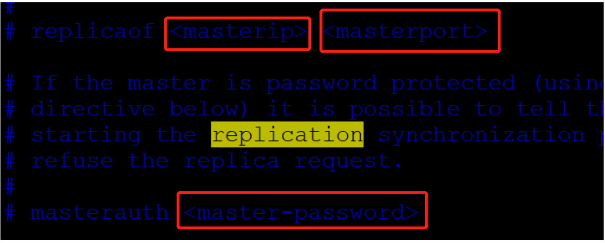

## 启动/连接

```sh
redis-server /etc/redis/redis.conf
redis-cli -h 127.0.0.1 -p 6379
```

## 数据类型

1. 字符串（strings）

   - 相当于java中的 **Map<String,String>**

   - ```shell
     set a b
     get a
     ```

2. 散列（hashes）

   - 相当于java中的 **Map<String,Map<String,String>>**

   - ```shell
     hmset user:1000 username antirez birthyear 1977 verified 1
     hget user:1000 username
     ```

3. 列表（lists）

   1. 相当于java中的 **Map<String, List<String>>**

4. 集合（sets）

   1. 相当于java中的 **Map<String, Set<String>>**

5. 有序集合（sorted sets)

   1. 相当于java中的 **Map<String, SortedSet<String>>**

6. bitmaps

   1. 二进制位存储

7. hyperloglogs

8. 地理空间（geospatial）

## 事务

- 开启事务（multi）
- 命令入队（……）
- 执行事务（exec）

注意

- Redis事务没有隔离级别的概念！
- 编译型异常（代码有问题！命令有错！），事务中所有的命令都不会被执行！
- 运行时异常，如果事务队列中存在语法性错误，那么执行命令的时候，其他命令式可以正常执行的，错误命令抛出异常！

## 锁

虽然redis是单线程，调用的客户端是多线程或着多客户端的，在输入事务过程中，有可能执行了其它客户端的命令，从而使事务中，使用了错误的数据。

```shell
#监控
watch key
```


## springboot整合redis

```java
@Configuration
public class RedisConfig {
    /**
     * 自己定义了一个redisTemplate
     * @param redisConnectionFactory
     * @return
     */
    @Bean
    public RedisTemplate<String, Object> redisTemplate(RedisConnectionFactory redisConnectionFactory) {
        // 为了自己开发方便，一般使用<String,Object>
        RedisTemplate<String, Object> template = new RedisTemplate();
        template.setConnectionFactory(redisConnectionFactory);
        // json的序列化配置
        Jackson2JsonRedisSerializer<Object> jackson2JsonRedisSerializer = new Jackson2JsonRedisSerializer<Object>(Object.class);
        ObjectMapper om = new ObjectMapper();
        om.setVisibility(PropertyAccessor.ALL, JsonAutoDetect.Visibility.ANY);
        om.enableDefaultTyping(ObjectMapper.DefaultTyping.NON_FINAL);
        jackson2JsonRedisSerializer.setObjectMapper(om);
        // string的序列化配置
        StringRedisSerializer stringRedisSerializer = new StringRedisSerializer();
        // key采用string序列化方式
        template.setKeySerializer(stringRedisSerializer);
        // hash的key也采用string的序列化方式
        template.setHashKeySerializer(stringRedisSerializer);
        // value采用Jackson的序列化方式
        template.setValueSerializer(jackson2JsonRedisSerializer);
        // hash的value也采用Jackson的序列化方式
        template.setHashValueSerializer(jackson2JsonRedisSerializer);
        template.afterPropertiesSet();
        return template;
    }
}
```


## 持久化

- rdb 完整快照
  - dump.rdb
- aof 记录操作命令
  - appendonly.aof

## 主从复制

​	修改从服务配置，主服务不需要修改。从服务指定主服务的ip和端口

​	


## 哨兵模式（重点）

通过一个或着多个监控程序来确认redis主服务器是否有宕机的，如果主服务器宕机则重新选出一个从服务器作为主服务器

```shell
# vim sentinel.conf
sentinel monitor 被监控的名称 host port 1
#运行
redis-sentinel sentinel.conf
```

缓存的数据一致性问题，


## 缓存穿透和雪崩

- **缓存穿透**,redis查不到的内容会向服务器查询，需要把结果存在redis,并设置过期时间
  - 对于攻击来说，不断查不在存的信息时，会不断缓存穿透
  - 布隆过滤器
    布隆过滤器是一种数据结构，对所有可能查询的参数以hash形式存储，在控制层先进行校验，不符合则丢弃，从而避免了对底层存储系统的查询压力；
  - 缓存空对象
    当存储层不命中后，即使返回的空对象也将其缓存起来，同时会设置一个过期时间，之后再访问这个数据将会从缓存中获取，保护了后端数据源；
- **缓存击穿**，访问量太大，缓存过期，在缓存过期的空档期，所有的访问砸在了MySQL服务器上，导致服务器宕机。
  - 设置热点数据永不过期
    从缓存层面来看，没有设置过期时间，所以不会出现热点key过期后产生的问题。
  - 加互斥锁
    分布式锁：使用分布式锁，保证对于每个key同时只有一个线程去查询后端服务，其他线程没有获得分布式锁的权限，因此只需要等待即可。这种方式将高并发的压力转移到了分布式锁，因此对分布式锁的考验很大。
- **缓存雪崩** 是指在某一个时间段，缓存集中过期失效。redis宕机
  - 设置热点数据永不过期
    从缓存层面来看，没有设置过期时间，所以不会出现热点key过期后产生的问题。
  - 加互斥锁
    分布式锁：使用分布式锁，保证对于每个key同时只有一个线程去查询后端服务，其他线程没有获得分布式锁的权限，因此只需要等待即可。这种方式将高并发的压力转移到了分布式锁，因此对分布式锁的考验很大。

