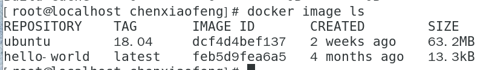
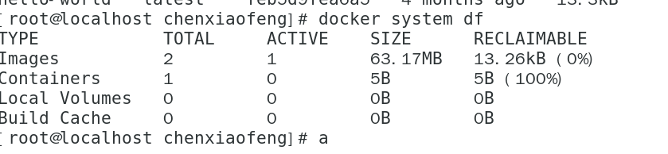

## **Docker** 包括三个基本概念

- **镜像**（`Image`），与java的类类拟，相当于代码模板
- **容器**（`Container`），与java的对象一样，通过代码模板创建
- **仓库**（`Repository`），与git类拟

## 安装 Docker

- 查开阿里云：https://developer.aliyun.com/mirror/docker-ce?spm=a2c6h.13651102.0.0.68001b11jwHVOD

## 镜像

### 获取镜像

-  docker pull [选项] [Docker Registry 地址[:端口号]/]仓库名[:标签]
- docker pull ubuntu:18.04

### 运行镜像

docker run -it --rm ubuntu:18.04 bash

- `-it`：这是两个参数，一个是 `-i`：交互式操作，一个是 `-t` 终端。我们这里打算进入 `bash` 执行一些命令并查看返回结果，因此我们需要交互式终端。
- `--rm`：这个参数是说容器退出后随之将其删除。默认情况下，为了排障需求，退出的容器并不会立即删除，除非手动 `docker rm`。我们这里只是随便执行个命令，看看结果，不需要排障和保留结果，因此使用 `--rm` 可以避免浪费空间。
- `ubuntu:18.04`：这是指用 `ubuntu:18.04` 镜像为基础来启动容器。
- `bash`：放在镜像名后的是 **命令**，这里我们希望有个交互式 Shell，因此用的是 `bash`。

### 列出镜像

docker image ls



### 删除本地镜像

docker image rm [选项] <镜像1> [<镜像2> ...]

其中，`<镜像>` 可以是 `镜像短 ID`、`镜像长 ID`、`镜像名` 或者 `镜像摘要`。

删除所有本地镜像

```
docker image rm $(docker image ls -q )
```

删除所有仓库名为 `redis` 的镜像

```
docker image rm $(docker image ls -q redis)
```


### 镜像体积

`docker system df` 命令来便捷的查看镜像、容器、数据卷所占用的空间



### 虚悬镜像

这个镜像原本是有镜像名和标签的，原来为 `mongo:3.2`，随着官方镜像维护，发布了新版本后，重新 `docker pull mongo:3.2` 时，`mongo:3.2` 这个镜像名被转移到了新下载的镜像身上，而旧的镜像上的这个名称则被取消，从而成为了 `<none>`。除了 `docker pull` 可能导致这种情况，`docker build` 也同样可以导致这种现象。由于新旧镜像同名，旧镜像名称被取消，从而出现仓库名、标签均为 `<none>` 的镜像。这类无标签镜像也被称为 **虚悬镜像(dangling image)** ，可以用下面的命令专门显示这类镜像：
$ docker image ls -f dangling=true
一般来说，虚悬镜像已经失去了存在的价值，是可以随意删除的，可以用下面的命令删除。
$ docker image prune

### 利用 commit 理解镜像构成

用于保存成新的镜像，但实际出产时，不会使用这种方式的，`docker commit` 命令除了学习之外，还有一些特殊的应用场合，比如被入侵后保存现场等。但是，不要使用 `docker commit` 定制镜像，定制镜像应该使用 `Dockerfile` 来完成

### 使用 Dockerfile 定制镜像

```shell
#Dockerfile 文件
FROM nginx
RUN echo '<h1>Hello, Docker!</h1>' > /usr/share/nginx/html/index.html

#运行
docker build -t nginx:v3 .
```

```shell
FROM 
RUN 
COPY 复制文件COPY [--chown=<user>:<group>] <源路径>... <目标路径>  COPY --chown=55:mygroup files* /mydir/
ADD 更高级的复制文件,不推荐使用
CMD 指令的格式和 RUN 相似，也是两种格式：
	shell 格式：CMD <命令>
	exec 格式：CMD ["可执行文件", "参数1", "参数2"...]
	参数列表格式：CMD ["参数1", "参数2"...]。在指定了 ENTRYPOINT 指令后，用 CMD 指定具体的参数。
	如果使用 shell 格式的话，实际的命令会被包装为 sh -c 的参数的形式进行执行。比如：
		CMD echo $HOME --> CMD [ "sh", "-c", "echo $HOME" ]
	Docker 不是虚拟机，容器中的应用都应该以前台执行,不然使命执行完之后，就会退出 
		CMD service nginx start --> 改成 CMD ["nginx", "-g", "daemon off;"]
ENTRYPOINT 的格式和 CMD  指令格式一样，不过ENTRYPOINT在运行docker时追加命令，而CMD会被替换
	ENTRYPOINT ["docker-entrypoint.sh"] 可以执行指定的脚本
ENV 设置环境变量
	ENV <key1>=<value1> <key2>=<value2>
	ENV VERSION=1.0 DEBUG=on NAME="Happy Feet"
ARG 构建参数
	构建参数和 ENV 的效果一样，都是设置环境变量。所不同的是，ARG 所设置的构建环境的环境变量，在将来容器运行时是不会存在这些环境变量的。
VOLUME 定义匿名卷
	VOLUME ["<容器内部路径1>", "<容器内部路径2>"...] 默认映射的位置为/var/lib/docker/volumes，不支持配置主机地址
	VOLUME <容器内部路径> 默认映射的位置为/var/lib/docker/volumes 
	运行时，可通过-v [host-dir]:[container-dir]:[rw|ro] 来替换
EXPOSE 暴露端口
	EXPOSE 指令是声明容器运行时提供服务的端口，这只是一个声明，在容器运行时并不会因为这个声明应用就会开启这个端口的服务。在 Dockerfile 中写入这样的声明有两个好处，一个是帮助镜像使用者理解这个镜像服务的守护端口，以方便配置映射；另一个用处则是在运行时使用随机端口映射时，也就是 docker run -P 时，会自动随机映射 EXPOSE 的端口。
	要将 EXPOSE 和在运行时使用 -p <宿主端口>:<容器端口> 区分开来。-p，是映射宿主端口和容器端口，换句话说，就是将容器的对应端口服务公开给外界访问，而 EXPOSE 仅仅是声明容器打算使用什么端口而已，并不会自动在宿主进行端口映射。

WORKDIR 指定工作目录
	WORKDIR <容器内部工作目录路径>，如果不存在，就会自动创建
	WORKDIR /app
USER 指定容器当前用户，USER 只是帮助你切换到指定用户而已，这个用户必须是事先建立好的，否则无法切换。
	RUN groupadd -r redis && useradd -r -g redis redis
	USER redis
	RUN [ "redis-server" ]
	下面使用gosu
	# 建立 redis 用户，并使用 gosu 换另一个用户执行命令
    RUN groupadd -r redis && useradd -r -g redis redis
    # 下载 gosu
    RUN wget -O /usr/local/bin/gosu "https://github.com/tianon/gosu/releases/download/1.12/gosu-amd64" \
        && chmod +x /usr/local/bin/gosu \
        && gosu nobody true
    # 设置 CMD，并以另外的用户执行
    CMD [ "exec", "gosu", "redis", "redis-server" ]
```

## 操作容器

### 启动

输出一个 “Hello World”，之后终止容器

```
$ docker run ubuntu:18.04 /bin/echo 'Hello world'
Hello world
```

下面的命令则启动一个 bash 终端，允许用户进行交互

```
docker run -it ubuntu:18.04 /bin/bash
```

启动已终止容器

```
docker start [container ID or NAMES]
```

守护态运行 -d
**注：** 容器是否会长久运行，是和 `docker run` 指定的命令有关，和 `-d` 参数无关。

```
$ docker run -d ubuntu:18.04 /bin/sh -c "while true; do echo hello world; sleep 1; done"
77b2dc01fe0f3f1265df143181e7b9af5e05279a884f4776ee75350ea9d8017a
```

获取容器的输出信息

```
$ docker  logs [container ID or NAMES]
hello world
hello world
hello world
. . .
```

### 终止

```
docker stop [container ID or NAMES]
```

### 进入容器

```
docker exec -it containerID /bin/bash
```

### 导出和导入

```shell
#导出
docker export containerID > ubuntu.tar
#本地导入
cat ubuntu.tar | docker import - test/ubuntu:v1.0
#URL 导入
docker import http://example.com/exampleimage.tgz example/imagerepo
```

### 删除

```shell
#删除
docker container rm containerID
docker  rm containerID
#清理所有处于终止状态的容器
docker container prune

```

## 数据管理

### 数据卷

```shell
#创建一个数据卷
docker volume create my-vol
#查看指定 数据卷 的信息
docker volume inspect my-vol

[
    {
        "Driver": "local",
        "Labels": {},
        "Mountpoint": "/var/lib/docker/volumes/my-vol/_data",
        "Name": "my-vol",
        "Options": {},
        "Scope": "local"
    }
]

#启动一个挂载数据卷的容器
docker run -d -P \
    --name web \
    # -v my-vol:/usr/share/nginx/html \
    --mount source=my-vol,target=/usr/share/nginx/html \  #同上？
    nginx:alpine
```

### 挂载主机目录

```shell
# 下面的命令加载主机的 /src/webapp 目录到容器的 /usr/share/nginx/html目录。这个功能在进行测试的时候十分方便，比如用户可以放置一些程序到本地目录中，来查看容器是否正常工作。本地目录的路径必须是绝对路径，以前使用 -v 参数时如果本地目录不存在 Docker 会自动为你创建一个文件夹，现在使用 --mount 参数时如果本地目录不存在，Docker 会报错。
docker run -d -P \
    --name web \
    # -v /src/webapp:/usr/share/nginx/html:ro \
    --mount type=bind,source=/src/webapp,target=/usr/share/nginx/html,readonly \
    nginx:alpine
```

## 网络

### 映射

```shell
#映射所有接口地址 80->80
docker run -d -p 80:80 nginx:alpine 
#映射到指定地址的指定端口
docker run -d -p 127.0.0.1:80:80 nginx:alpine
#映射到指定地址的任意端口
docker run -d -p 127.0.0.1::80 nginx:alpine
#还可以使用 udp 标记来指定 udp 端口
docker run -d -p 127.0.0.1:80:80/udp nginx:alpine
docker port containerID 80

```

### 容器互联

```shell
#新建网络 -d 参数指定 Docker 网络类型，有 bridge overlay
docker network create -d bridge my-net
#启动时指定连接容器
docker run -it --rm --name busybox1 --network my-net busybox sh
docker run -it --rm --name busybox2 --network my-net busybox sh
docker container ls
$ docker container ls
CONTAINER ID    IMAGE     COMMAND     CREATED             STATUS           PORTS     NAMES
b47060aca56b    busybox   "sh"        11 minutes ago      Up 11 minutes              busybox2
8720575823ec    busybox   "sh"        16 minutes ago      Up 16 minutes              busybox1
```

## Docker Compose

### 安装

```shell
#到github找最新的https://github.com/docker/compose/releases

# 下载1.25.0 docker compose
sudo curl -L "https://github.com/docker/compose/releases/download/v2.2.3/docker-compose-$(uname -s)-$(uname -m)" -o /usr/local/bin/docker-compose
# 添加可执行权限
sudo chmod +x /usr/local/bin/docker-compose
# 测试安装
sudo docker-compose --version
```

