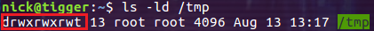

## 文件类型

- 普通文件类型
Linux中最多的一种文件类型, 包括 纯文本文件(ASCII)；二进制文件(binary)；数据格式的文件(data);各种压缩文件。第一个属性为 [-] 。

- 目录文件类型
在linux中，它的思想是一切皆是文件，目录文件也就是Windows中的目录，也就是能用 cd 命令进入的。第一个属性为 [d]，例如 [drwxr-xr-x]。
- 字符设备文件
即串行端口的接口设备，例如键盘、鼠标等等。第一个属性为 [c]。
- 块设备文件
即存储数据以供系统存取的接口设备，简单而言就是硬盘。例如一号硬盘的代码是 /dev/hda1等文件。第一个属性为 [b]。
- 套接字文件
这类文件通常用在网络数据连接。可以启动一个程序来监听客户端的要求，客户端就可以通过套接字来进行数据通信。第一个属性为 [s]，最常在 /var/run目录中看到这种文件类型。
- 管道文件
FIFO也是一种特殊的文件类型，它主要的目的是，解决多个程序同时存取一个文件所造成的错误。FIFO是first-in-first-out(先进先出)的缩写。第一个属性为 [p]。
- 链接文件
类似Windows下面的快捷方式。第一个属性为 [l]，例如 [lrwxrwxrwx]。


## 文件属性

```
dr-xr-xr-x   2 root root 4096 Dec 14  2012 bin
```


- 当为 **d** 则是目录
- 当为 **-** 则是文件；
- 若是 **l** 则表示为链接文档(link file)；
- 若是 **b** 则表示为装置文件里面的可供储存的接口设备(可随机存取装置)；
- 若是 **c** 则表示为装置文件里面的串行端口设备，例如键盘、鼠标(一次性读取装置)。


### 特殊权限SUID, SGID, SBIT:

```shell
[root@www ~]# ls -ld /tmp ; ls -l /usr/bin/passwd /usr/bin/locate /var/lib/mlocate/mlocate.db
drwxrwxrwt 7 root root 4096 Sep 27 18:23 /tmp
-rwsr-xr-x 1 root root 22984 Jan 7 2007 /usr/bin/passwd
-rwx--s--x 1 root slocate 23856 Mar 15 2007 /usr/bin/locate
-rw-r----- 1 root slocate 3175776 Sep 28 04:02 /var/lib/mlocate/mlocate.db
```
**Set UID**:**对二进位程序有效**，**出现在文件拥有者的 x 权限**，普通用户运行时，暂时获取**文件所有者**相同的权限
当 s 这个标志出现在**文件拥有者的 x 权限**上时,如上 /usr/bin/passwd 这个文件的权限状态，此时就被称为 Set UID，简称为 SUID 的特殊权限。限制与功能：

- SUID 权限仅对二进位程序(binary program)有效(不能够用在 shell script 上面)
- 运行者对於该程序需要具有 x 的可运行权限
- 本权限仅在运行该程序的过程中有效 (run-time)
- 运行者将具有该程序拥有者 (owner) 的权限

以passwd文件为例:

vbird 对於 /usr/bin/passwd 这个程序来说是具有 x 权限的，表示 vbird 能运行 passwd；
passwd 的拥有者是 root 这个帐号；vbird 运行 passwd 的过程中，会『暂时』获得 root 的权限；
/etc/shadow 就可以被 vbird 所运行的 passwd 所修改。
但如果 vbird 使用 cat 去读取 /etc/shadow 时，他能够读取吗？因为 cat 不具有 SUID 的权限，所以 vbird 运行 『cat /etc/shadow』 时，是不能读取 /etc/shadow 的。我们用一张示意图来说明如下：
图4.4.1、SUID程序运行的过程示意图

**SGID**:**对文件或目录有效**，**出现在用户组的 x 权限**，普通用户运行时，暂时获取**文件所有组**相同的权限

- SGID 对二进位程序有用,程序运行者对於该程序来说，需具备 x 的权限
- 运行者在运行的过程中将会获得该程序群组的权限
- 对普通文件有用

如果针对的是目录,SGID 有如下的功能：

- 使用者若对於此目录具有 r 与 x 的权限时，该使用者能够进入此目录；
- 使用者在此目录下的有效群组(effective group)将会变成该目录的群组；

**SBIT**: **the restricted deletion flag or sticky bit 的简称**,对目录有效，用来阻止非文件的所有者删除文件,

- 权限信息中最后一位 t 表明该目录被设置了 SBIT 权限。SBIT 对目录的作用是：当用户在该目录下创建新文件或目录时，仅有自己和 root 才有权力删除。



## 图示软硬链接的区别


## 硬链接

- 具有相同inode节点号的多个文件互为硬链接文件；
- 删除硬链接文件或者删除源文件任意之一，文件实体并未被删除；
- 只有删除了源文件和所有对应的硬链接文件，文件实体才会被删除；
- 硬链接文件是文件的另一个入口；
- 可以通过给文件设置硬链接文件来防止重要文件被误删；
- 创建硬链接命令 ln 源文件 硬链接文件；
- 硬链接文件是普通文件，可以用rm删除；
- 对于静态文件（没有进程正在调用），当硬链接数为0时文件就被删除。注意：如果有进程正在调用，则无法删除或者即使文件名被删除但空间不会释放。

## 软链接

- 软链接类似windows系统的快捷方式；
- 软链接里面存放的是源文件的路径，指向源文件；
- 删除源文件，软链接依然存在，但无法访问源文件内容；
- 软链接失效时一般是白字红底闪烁；
- 创建软链接命令 ln -s 源文件 软链接文件；
- 软链接和源文件是不同的文件，文件类型也不同，inode号也不同；
- 软链接的文件类型是“l”，可以用rm删除。

## 硬链接和软链接的区别

原理上，硬链接和源文件的inode节点号相同，两者互为硬链接。软连接和源文件的inode节点号不同，进而指向的block也不同，软连接block中存放了源文件的路径名。 实际上，硬链接和源文件是同一份文件，而软连接是独立的文件，类似于快捷方式，存储着源文件的位置信息便于指向。 使用限制上，不能对目录创建硬链接，不能对不同文件系统创建硬链接，不能对不存在的文件创建硬链接；可以对目录创建软连接，可以跨文件系统创建软连接，可以对不存在的文件创建软连接。

