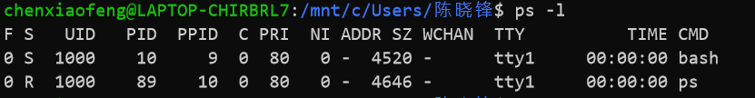

## 进程

- ### ps 显示进程

  - -aux 显示所有包含其他使用者的行程 
  - -A 显示所有进程
  - -u 指定用户的所有进程
  - -ef 显示所有进程及程序间的关系
  - -l 将目前属于您自己这次登入的 PID 与相关信息列示出来
  - #### 各相关信息的意义：
    
    - F 代表这个程序的旗标 (flag)， 4 代表使用者为 super user
    - S 代表这个程序的状态 (STAT)
      - R ：该程序目前正在运作，或者是可被运作
      - S ：该程序目前正在睡眠当中 (可说是 idle 状态)，但可被某些讯号 (signal) 唤醒。 
      - T ：该程序目前正在侦测或者是停止了 
      - Z ：该程序应该已经终止，但是其父程序却无法正常的终止他，造成 zombie (疆尸) 程序的状态
    - UID 程序被该 UID 所拥有
    - PID 就是这个程序的 ID ！
    - %CPU：该 process 使用掉的 CPU 资源百分比
    - %MEM：该 process 所占用的物理内存百分比
    - VSZ ：该 process 使用掉的虚拟内存量 (Kbytes)
    - RSS ：该 process 占用的固定的内存量 (Kbytes)
    - PPID 则是其上级父程序的ID
    - C CPU 使用的资源百分比
    - PRI 这个是 Priority (优先执行序) 的缩写
    - NI 这个是 Nice 值，在下一小节我们会持续介绍
    - ADDR 这个是 kernel function，指出该程序在内存的那个部分。如果是个 running的程序，一般就是 "-"
    
    - SZ 使用掉的内存大小
    
    - WCHAN 目前这个程序是否正在运作当中，若为 - 表示正在运作
    
    - TTY 登入者的终端机位置
    
    - TIME 使用掉的 CPU 时间。
    
    - CMD 所下达的指令为何
    
    - 
    
    - 

- ### pstree

  - -aup树状显示所有进程
  - 参数 
    - -a：显示每个程序的完整指令，包含路径，参数或是常驻服务的标示； 
    - -c：不使用精简标示法； 
    - -G：使用VT100终端机的列绘图字符； 
    - -h：列出树状图时，特别标明现在执行的程序；
    -  -H<程序识别码>：此参数的效果和指定”-h”参数类似，但特别标明指定的程序； 
    - -l：采用长列格式显示树状图； 
    - -n：用程序识别码排序。预设是以程序名称来排序；
    -  -p：显示程序识别码； -u：显示用户名称；

- ### kill   [参数] [进程id]

  - -9 PID,强制终结PID进行

  - 参数

    - HUP  1  终端断线
    - INT   2  中断（同 Ctrl + C）
    - QUIT  3  退出（同 Ctrl + \）
    - TERM  15  终止
    - KILL  9  强制终止
    - CONT  18  继续（与STOP相反， fg/bg命令）
    - STOP  19  暂停（同 Ctrl + Z）

## 打包和压缩

- ### tar,打包，通过参数支持是否使用压缩
  
  - 常用方法
    - -cvf name.tar  打包，不压缩
    - -xvf name.tar 解包
    - -zcvf 打包，压缩
    - -zxvf 解压解包
    - tar -zcvf dm2box.tar.gz /home/dm2box   最后的参数为解压地址
  - 常用参数
    - -A 新增压缩文件到已存在的压缩
    - -B 设置区块大小
    - -c 建立新的压缩文件
    - -d 记录文件的差别
    - -r 添加文件到已经压缩的文件
    - -u 添加改变了和现有的文件到已经存在的压缩文件
    - -x 从压缩的文件中提取文件
    - -t 显示压缩文件的内容
    - -z 支持gzip解压文件
    - -j 支持bzip2解压文件
    - -Z 支持compress解压文件
    - -v 显示操作过程
    - -l 文件系统边界设置
    - -k 保留原有文件不覆盖
    - -m 保留文件不被覆盖
    - -W 确认压缩文件的正确性
- ### zip与unzip
  
  - zip -r myfile.zip ./*     将当前目录下的所有文件和文件夹全部压缩成myfile.zip文件,－r表示递归压缩子目录下所有文件.
  - unzip -o -d /home/sunny myfile.zip  把myfile.zip文件解压到 /home/sunny/
    - -o:不提示的情况下覆盖文件；
    - -d:-d /home/sunny 指明将文件解压缩到/home/sunny目录下；

## 网络

- ### 网络配置
  
  - ifconfig
  - ip
  - iwconfig
  - ethtool
  - ifup
  - ifdown
- ### 网络连通性
  
  - ping
  - traceroute
  - telnet命令 (已经被SSH取代)
  - ssh
  - mtr
- ### 网络连接
  
  - netstat
  - ss
  - nc（netcat）
  - lsof
- ### 流量统计
  
  - ifstat
  - sar
  - iftop
- ### 交换与路由
  
  - arp
  - arping
  - vconfig
  - route
- ### 防火墙
  
  - iptables
  - ipset
- ### 域名
  
  - host
  - hostname
  - nslookup
  - dig
  - whois
- ### 抓包
  
  - tcpdump
- ### 虚拟设备
  
  - tunctl
  - brctl
  - ovs
- ### 下载
  
  - wget

## yum使用

- 语法

  ```
  yum [options] [command] [package ...]
  ```

- 列出所有可更新的软件清单命令：yum check-update

- 更新所有软件命令：yum update

- 仅安装指定的软件命令：yum install <package_name>

- 仅更新指定的软件命令：yum update <package_name>

- 列出所有可安裝的软件清单命令：yum list

- 删除软件包命令：yum remove <package_name>

- 查找软件包命令：yum search <keyword>

- 清除缓存命令:

  - yum clean packages: 清除缓存目录下的软件包
  - yum clean headers: 清除缓存目录下的 headers
  - yum clean oldheaders: 清除缓存目录下旧的 headers
  - yum clean, yum clean all (= yum clean packages; yum clean oldheaders) :清除缓存目录下的软件包及旧的 headers

文件目录

- 常用命令
  - ls（英文全拼：list files）: 列出目录及文件名
    - -a ：全部的文件，连同隐藏文件( 开头为 . 的文件) 一起列出来(常用)
    - -d ：仅列出目录本身，而不是列出目录内的文件数据(常用)
    - -l ：长数据串列出，包含文件的属性与权限等等数据；(常用)
    - -->使用ll
  - cd（英文全拼：change directory）：切换目录
    - cd -  返回上一个目录
    - cd ~ 去到家目录
    - -P  如果切换的目标目录是一个符号链接，则直接切换到符号链接指向的目标目录
    - -L 如果切换的目标目录是一个符号链接，则直接切换到符号链接名所在的目录
  - pwd（英文全拼：print work directory）：显示目前的目录
  - mkdir（英文全拼：make directory）：创建一个新的目录
  - rmdir（英文全拼：remove directory）：删除一个空的目录
  - cp（英文全拼：copy file）: 复制文件或目录
  - rm（英文全拼：remove）: 删除文件或目录
  - mv（英文全拼：move file）: 移动文件与目录，或修改文件与目录的名称

搜索，finger

磁盘

内存信息

CPU信息

系统信息

用户用户组

权限

系统信息和硬件信息

文件传输

文本处理

编译安装

数据重定向

链接

定时器

- crontab 

系统服务命令

备份


